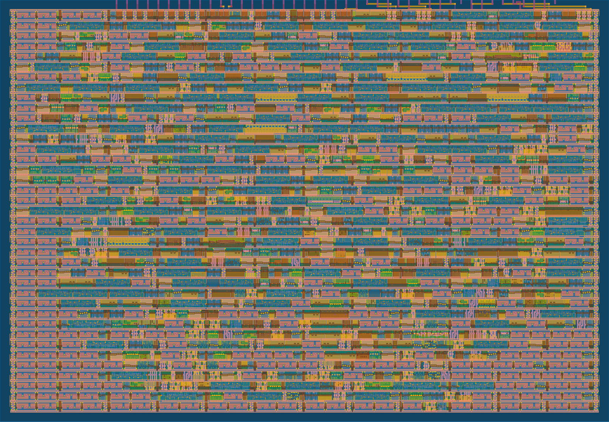

<!---

This file is used to generate your project datasheet. Please fill in the information below and delete any unused
sections.

You can also include images in this folder and reference them in the markdown. Each image must be less than
512 kb in size, and the combined size of all images must be less than 1 MB.
-->

## How it works

2-Channel Sine and Triangle Wave Sound Chip with 8-bit PWM Output.

Two 16-bit registers, written through a parallel bus interface, to control the frequencies of channel 1 (sine) and channel 2 (triangle). Register values go to both `sine` and `triangle` wave modules, which uses [Direct Digital Synthesis (DDS)](https://en.wikipedia.org/wiki/Direct_digital_synthesis), to generate 7-bit digital samples at varying frequencies with a sample rate of 28160 Hz. The 7-bit values are added together to an 8-bit sample which is converted to a PWM signal. Each 8-bit sample is converted to four 112640 Hz PWM pulses. The base clock is thus 256x the PWM frequency at 28835840 Hz (~28.84 MHz).

Recommended generated frequency range: 220-1960 Hz

The `phase_counter` module is simply a 10-bit counter that counts up with the clock and outputs the counter value `subsample_phase`. Each counter period corresponds to one sample.

The `sine` module uses CORDIC to algorithmically estimate sine values. The stages of estimation and updating outputs are coordinated with `subsample_phase`. The triangle module uses Direct Digital Synthesis (DDS) to create a uniform increasing and decreasing ramp waveform with the specified period.

### GDS Render



## Architecture

### Block Diagram


The architecture consists of several key components:
- **register_interface**: Implements the write protocol and two 16-bit frequency control registers `registers[0]` and `registers[1]`.
- **triangle_gen**: Generates a triangle waveform into `bitstream_ch2` based on `registers[1][11:0]`.
- **sine_gen**: Generates a sine waveform into `bitstream_ch1` based on `registers[0][11:0]`.
- **phase_counter**: Implements a 10-bit counter on `subsample_phase[9:0]` used for the timings of all waveform and PWM updates.
- **pwm_gen**: Adds both channels and compares the waveforms against `subsample_phase[7:0]` to produce `pwm_out`.

### Register map
| Register    | Description           |
|-------------|-----------------------|
| 0b0000      | freq_ch1* (sine)      |
| 0b0001      | freq_ch2* (triangle)  |
| 0b0010-1111 | Reserved/Unused       |

**only the least significant 12 bits of frequency registers are read.*

To calculate register values from frequency f in Hz, use the following formula:


where f<sub>sample</sub> = 28160 Hz, the output sample rate.

## Pinout
**Clock frequency**: 28835840 Hz (~28.8 MHz)

**Reset**: active low

| # | Input                   | Output     | Bidirectional        |
|---|-------------------------|------------|----------------------|
| 0 | Register bus address[0] | -          | Register bus data[0] |
| 1 | Register bus address[1] | -          | Register bus data[1] |
| 2 | Register bus address[2] | -          | Register bus data[2] |
| 3 | Register bus address[3] | -          | Register bus data[3] |
| 4 | Transfer phase          | -          | Register bus data[4] |
| 5 | Transfer enable         | -          | Register bus data[5] |
| 6 | Unused                  | -          | Register bus data[6] |
| 7 | Unused                  | PWM output | Register bus data[7] |

### Bus details
To write to registers:
0. Start with `enable = 0`
1. Set address bits, most significant 8 bits of data, and phase to 1 for at least 2 clock cycles.
2. Set `enable = 1` for at least 2 cycles. When this edge is detected, the most significant 8 bits will be read.
3. Set `phase = 0` for at least 2 cycles. When this edge is detected, the least significant 8 bits will be read.
4. Set `enable = 0` for at least 2 cycles. When this edge is detected, the full register value will be written at the specified address.

If any of these steps are violated, the internal state machine will either:
- if `enable = 1`: transition into an error state which can be reset by toggling enable back to 0
- if `enable = 0`: discard the ongoing bus transfer and reset to idle state

See `src/register_interface.v` for the exact details of the bus transfer logic.

## Requirements

- **Yosys OSS CAD suite**: https://github.com/YosysHQ/oss-cad-suite-build
- **KiCad** (optional, for simulating and exporting DAC frequency response)
- **Python modules**: numpy, scipy

## How to test
Remember to source OSS CAD suite. `gtkwave` can be used to view output waveforms of tests.

### System-Level Tests

```
cd test/
```

**RTL test**:

```
make -B
```

**Gate-level test** (requires hardening first. see [Hardening section](#hardening--viewing)):

```
TOP_MODULE=$(cd .. && ./tt/tt_tool.py --print-top-module)
```

```
cp ../runs/wokwi/final/pnl/$TOP_MODULE.pnl.v gate_level_netlist.v
```

```
make -B GATES=yes
```

*These tests are also run by the TinyTapeout Github Actions.*

### Block-Level Tests
A cocoTB testbench is used to run tests in Python. Each test uses the following structure:
- Sets up the system clock using cocoTB `Clock`.
- Initializes all DUT inputs and de-asserts `rst_n` after some cycles.
- Drives stimuli into the DUT and runs for several cycles (`await ClockCycles(...)`)
- Checks the assertions on the outputs to verify the correct behaviour and result.

These are RTL tests only. There are four block-level test directories and a full integration test:
- `test/tb_pwm_phase` - for phase_counter and pwm
- `test/tb_regs` - for register_interface
- `test/tb_sine` - for sine waveform
- `test/tb_triangle` - for triangle waveform
- `test/test.py` - full integration test

For each one, enter the directory and run `make -B`.

#### Expected Block-Level Test Results
These are the results when run, your values may vary slightly.

##### tb_pwm_phase
| Test                                               | Status | Sim Time (ns) | Real Time (s) | Ratio (ns/s) |
|----------------------------------------------------|--------|---------------|---------------|--------------|
| pwm_phase_test.test_reset_while_running            | PASS   | 18375.00      | 0.01          | 1392040.82   |
| pwm_phase_test.test_phase_counter_counts_and_wraps | PASS   | 36575.00      | 0.03          | 1392378.31   |
| pwm_phase_test.test_pwm_duty_matches_sample_sum    | PASS   | 99365.00      | 0.08          | 1281090.80   |
| pwm_phase_test.test_pwm_sample_sum_overflow_edge   | PASS   | 54565.00      | 0.04          | 1299164.98   |
| pwm_phase_test.test_pwm_phase_threshold_behavior   | PASS   | 2303385.00    | 1.96          | 1173998.96   |
| **TESTS=5 PASS=5 FAIL=0 SKIP=0**                   |        | **2512265.00**| **2.14**    | **1174446.22** |

##### tb_regs
| Test                                             | Status | Sim Time (ns) | Real Time (s) | Ratio (ns/s) |
|--------------------------------------------------|--------|---------------|---------------|--------------|
| regs_test.test_regs_reset                        | PASS   | 2450.00       | 0.00          | 1020157.75   |
| regs_test.test_regs_mid_transaction_reset        | PASS   | 665.00        | 0.00          | 1122872.93   |
| regs_test.test_regs_double_write                 | PASS   | 3920.00       | 0.00          | 1284405.58   |
| regs_test.test_regs_timing                       | PASS   | 17891720.00   | 11.35         | 1577041.76   |
| regs_test.test_regs_extreme_values               | PASS   | 11270.00      | 0.01          | 1362046.11   |
| regs_test.test_regs_error_states                 | PASS   | 11200.00      | 0.01          | 768866.56    |
| regs_test.test_regs_large_addresses              | PASS   | 12180.00      | 0.01          | 1386302.32   |
| regs_test.test_regs_address_boundary_and_no_clobber | PASS | 5670.00      | 0.00          | 1395558.23   |
| **TESTS=8 PASS=8 FAIL=0 SKIP=0**                 |        | **17939075.01** | **11.41** | **1572503.84** |

##### tb_sine
| Test                              | Status | Sim Time (ns) | Real Time (s) | Ratio (ns/s) |
|-----------------------------------|--------|---------------|---------------|--------------|
| sine_test.test_sine_reset         | PASS   | 18200.00      | 0.02          | 1096046.30   |
| sine_test.test_random_frequencies | PASS   | 43044400.00   | 35.99         | 1196040.83   |
| sine_test.test_silence            | PASS   | 3656240.00    | 3.05          | 1199115.46   |
| **TESTS=3 PASS=3 FAIL=0 SKIP=0**  |      | **46718840.00** | **39.07**   | **1195669.64** |

##### tb_triangle
| Test                                                     | Status | Sim Time (ns) | Real Time (s) | Ratio (ns/s) |
|----------------------------------------------------------|--------|---------------|---------------|--------------|
| triangle_test.test_reset1                                | PASS   | 60.00         | 0.00          | 65214.42     |
| triangle_test.test_reset2                                | PASS   | 6148200.00    | 0.89          | 6927668.03   |
| triangle_test.test_midrun_reset_clears_wave              | PASS   | 123000.00     | 0.36          | 340395.99    |
| triangle_test.test_accumulator_increment                 | PASS   | 170.00        | 0.00          | 272047.26    |
| triangle_test.test_frequency_control                     | PASS   | 82020.00      | 0.24          | 338374.42    |
| triangle_test.test_max_freq_increment_overflow_behavior  | PASS   | 2037900.00    | 6.01          | 339309.66    |
| triangle_test.test_triangle_wave_shape                   | PASS   | 1013900.00    | 3.06          | 331132.01    |
| triangle_test.test_full_range                            | PASS   | 5109900.00    | 15.19         | 336412.01    |
| triangle_test.test_continuous_waveform                   | PASS   | 2037900.00    | 6.20          | 328568.91    |
| triangle_test.test_zero_frequency                        | PASS   | 102450.00     | 0.32          | 318233.89    |
| **TESTS=10 PASS=10 FAIL=0 SKIP=0**                       |      | **16655500.01** | **32.30**    | **515651.83** |

##### test.py
| Test                            | Status | Sim Time (ns) | Real Time (s) | Ratio (ns/s) |
|---------------------------------|--------|---------------|---------------|--------------|
| test.play_a_tune                | PASS   | 10001010.00   | 6.08          | 1646113.23   |
| test.single_sine_note           | PASS   | 3002100.00    | 1.89          | 1586899.63   |
| test.single_triangle_note       | PASS   | 3002100.00    | 1.83          | 1640564.33   |
| test.sine_and_triangle_together | PASS   | 3002100.00    | 1.82          | 1653389.06   |
| **TESTS=4 PASS=4 FAIL=0 SKIP=0** |     | **19007310.00** | **11.63**   | **1634247.66** |

### Audio Test
This test runs a really long (around 1s sim time) RTL simulation, exports the data, then simulates the PWM signal being filtered by the Audio Pmod circuit to generate a .wav file that you can listen to!
1. `cd test/ && make -B AUDIO=yes` - this takes 10 minutes on my machine, will vary depending on hardware. It generates three tones of 0.3s each. This will create `pwm_edges.log` in the `test/` directory.
2. `cd ../pmod-sim/` and run the KiCad ngspice simulation of the Pmod circuit to export the frequency response, or use the pre-simulated `freq_response.csv`.
3. run `filter_pwm.py`, which will apply the filter to the `pwm_edges.log` file and create `output.wav`.

## Hardening & Viewing
See: https://tinytapeout.com/guides/local-hardening/

## External hardware

**Audio Pmod required**: [Audio-Pmod-p716541601](store.tinytapeout.com/products/Audio-Pmod-p716541601)

## Project Duties & Acknowledgements

Evan Li: 
- `sine.v`
- `register_interface.v`
- `phase_counter.v`
- `audio_chip.v`
- `pwm.v`
- `/tb_regs` sub-block tests
- `/tb_sine` sub-block tests
- Audio test - `audio_test.py`, `audio_util.py`
- pmod simulation - `/pmod-sim`
- Integration tests - `test.py`

Rongbin Gu: 
- `triangle.v`
- `sync.v`
- `audio_chip.v`
- `pwm.v`
- `/tb_pwm_phase` sub-block tests
- `/tb_regs` sub-block tests
- `/tb_triangle` sub-block tests
- Integration tests - `test.py`
