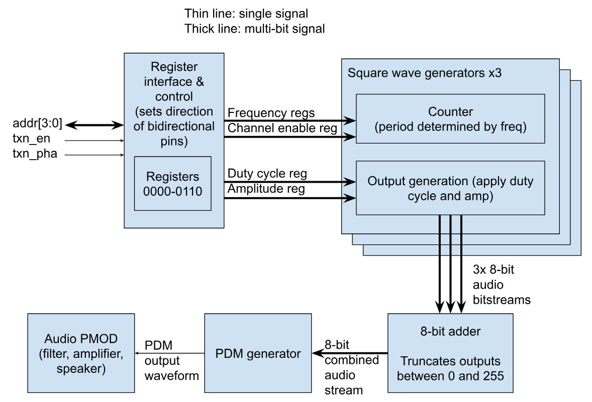

<!---

This file is used to generate your project datasheet. Please fill in the information below and delete any unused
sections.

You can also include images in this folder and reference them in the markdown. Each image must be less than
512 kb in size, and the combined size of all images must be less than 1 MB.
-->

## How it works

3-channel square wave sound chip with support for amplitude, frequency, and duty cycle updates per channel.

## Requirements

- Yosys OSS CAD suite:
  https://github.com/YosysHQ/oss-cad-suite-build

### Block diagram

### Register map
| Register    | Description           |
|-------------|-----------------------|
| 0b0000      | freq_ch1* (sine)      |
| 0b0001      | freq_ch2* (triangle)  |
| 0b0010-1111 | Reserved/unused       |

*Least significant 12 bits of frequency registers are read.
To calculate register values from frequency f in Hz, use the following formula:

freq_chX = round((f * 2^14) / f_sample)

where f_sample = 28160 Hz, the output sample rate.

## How to test

### System-Level Tests

### Block-Level Tests

## External hardware

Audio Pmod required: [store.tinytapeout.com/products/Audio-Pmod-p716541601]()

## Pinout
Clock frequency: 28835840 Hz
Reset: active low

| # | Input                   | Output     | Bidirectional        |
|---|-------------------------|------------|----------------------|
| 0 | Register bus address[0] | -          | Register bus data[0] |
| 1 | Register bus address[1] | -          | Register bus data[1] |
| 2 | Register bus address[2] | -          | Register bus data[2] |
| 3 | Register bus address[3] | -          | Register bus data[3] |
| 4 | Transfer phase          | -          | Register bus data[4] |
| 5 | Transfer enable         | -          | Register bus data[5] |
| 6 | -                       | -          | Register bus data[6] |
| 7 | -                       | PDM output | Register bus data[7] |

### Bus details

To write to registers:
0. Start with enable = 0
1. Set address bits, most significant 8 bits of data, and phase to 1 for at least 2 clock cycles.
2. Set enable to 1 for at least 2 cycles. When this edge is detected, the most significant 8 bits will be read.
3. Set phase to 0 for at least 2 cycles. When this edge is detected, the least significant 8 bits will be read.
4. Set enable to 0 for at least 2 cycles. When this edge is detected, the full register value will be written at the specified address.